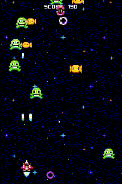

<h1 align="center">
   
  
   
  Galaxy Protector
   
</h1>

<h4 align="center">A 2d shootem up game built with <a href="https://godotengine.org/" target="_blank">Godot</a>.</h4>

  <a href="#key-features">Key Features</a> •
  <a href="#how-to-use">How To Use</a> •
  <a href="#download">Download</a> •
  <a href="#credits">Credits</a> •

  

## Key Features

* Component based
  - Custom Godot components 
* Main menu
* Parallax effect background
* Animated character and enemy sprites 
* Difficulty curve based on the number of enemies defeated
  - Random spawning location for enemies
* Highscore 
* Enemy Projectiles

## How To Use

## Download

You can [download](galaxyShooter.zip) the latest installable version of Galaxy Protector for Windows.

## Credits

## Related

## Support

## You may also like...

- [Pomolectron](https://github.com/amitmerchant1990/pomolectron) - A pomodoro app
- [Correo](https://github.com/amitmerchant1990/correo) - A menubar/taskbar Gmail App for Windows and macOS

## License

MIT

---

> Design Portfolio [darrenwoodward.me](https://www.darrenwoodward.me) &nbsp;&middot;&nbsp;
> GitHub [@/darrenwoodward](https://github.com//darrenwoodward) &nbsp;&middot;&nbsp;
> LinkedIn [@DarrenWoodward](https://www.linkedin.com/in/darren-woodward/)
